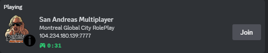
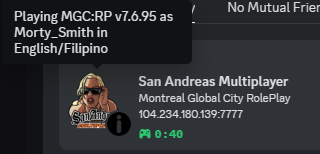
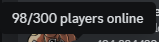

# SA:MP/open.mp Discord Rich Presence plugin

This plugin features custom server logos

## How to add your own servers with logos:
1. Fork the repository
2. Create `ip_port.json` (e.g. `127.0.0.1_7777.json`) file in `servers` folder
3. Fill-up this (optional fields can be empty)
```json
{
    "application_id": "", // optional, you can create your own discord-rpc on https://discord.com/developers/applications and use the assets to "logo" and "small_image".
    "logo": "", // optional
    "small_image": "", // optional
    "large_text": "", // optional
    "small_text": "", // optional
    "details": "", // optional
    "state": "", // optional
    "buttons": [] // optional
}
```

button structure:
```json
{
    "label": "",
    "url": ""
}
```

example:
```jsonc
{
    // ... other config
    "buttons": [
        {
            "label": "",
            "url": ""
        }
    ]
}
```
4. Create pull request
5. Wait to be accepted.

## Placeholders

This plugin also has support for placeholders.

Current placeholders:

- SERVER_NAME
- SERVER_IP
- SERVER_PORT
- USERNAME
- PLAYERS
- MAX_PLAYERS
- LANGUAGE
- GAMEMODE

### Example usage of placeholders

Playing in {SERVER_NAME}.

## Preview




## Special thanks to:
- Hual - for creating [samp-discord-plugin](https://github.com/Hual/samp-discord-plugin)
- open.mp team - the [query.cpp](./src/query.cpp) is from one of their projects, I just asked AI to convert it to C++ from Rust.
